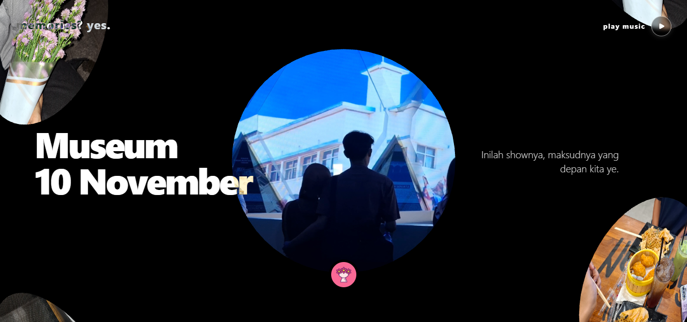

# 📸 Memories? Yes. - Cinematic Infinite Photo Album

A cinematic, interactive digital photo album built with **React**, **WebGL**, and **Tailwind CSS**. Designed to showcase memories in an infinite circular menu with immersive background music and audio visualization.


## 🌟 Features

- **Cinematic Intro:** "Text Pressure" effect with distortion animation before entering the album.
- **Infinite Circular Menu:** WebGL-based infinite scroll navigation with texture distortion effects.
- **Interactive Music Player:**
  - Custom audio visualizer (Real-time bouncing bars).
  - Mobile-friendly autoplay handling (Touch-to-start).
  - Glassmorphism UI design.
- **Responsive Design:** Optimized for Desktop, Tablet, and Mobile.
- **Performance:** Uses Skeleton loading states for smooth asset rendering.

## 🛠️ Tech Stack

- **Framework:** [React.js](https://react.dev/) + [Vite](https://vitejs.dev/)
- **Styling:** [Tailwind CSS](https://tailwindcss.com/)
- **Animation & 3D:** WebGL (Custom Shaders), CSS Keyframes
- **Deployment:** [Vercel](https://vercel.com/)

## 📂 Project Structure

```text
├── public/
│   └── foto/          # 🖼️ MAIN PHOTO STORAGE LOCATION
│       ├── 1.jpg
│       ├── 2.jpg
│       └── ...
├── src/
│   ├── assets/
│   │   └── song/      # 🎵 MUSIC FILE LOCATION (.mp3)
│   ├── components/
│   │   ├── bits/
│   │   │   ├── InfiniteMenu.jsx  # Core WebGL Logic
│   │   │   ├── TextPressure.jsx  # Intro Animation
│   │   │   └── Skeleton.jsx      # Loading State
│   └── App.jsx        # Main Logic (Data & Config)
```

## 🚀 How to Run Locally

1. Clone the repository
```bash
git clone https://github.com/SandyAryadika/a-gift-v2.git
cd repo-name
```

2. Install Dependencies
```bash
npm install
```

3. Run Development Server
```bash
npm run dev
```

## 🎨 Customization Guide

1. Changing Photos
- Put your images in the public/foto/ folder.
- IMPORTANT: Rename files sequentially: 1.jpg, 2.jpg, 3.jpg, etc.
- Note: Ensure file extensions are lowercase (.jpg, not .JPG) to avoid issues on Vercel (Linux environment).

2. Changing Texts (Titles & Descriptions)
Open ```src/App.jsx``` and modify the ```items``` array:
```text
const items = [
  {
    image: '/foto/1.jpg',
    title: <>Judul<br />Baru</>, // Use <br/> for line breaks
    description: 'Tulis deskripsi kenangan di sini.'
  },
  // ...
];
```

3. Changing Music
- Replace the file in ```src/assets/song/``` with your new ```.mp3```.
- Update the import in ```src/App.jsx```:
```text
import bgm from './assets/song/your-new-song.mp3';
```

## ⚠️ Common Issues & Fixes
1. Images not showing on Vercel?
- Check if the folder name is lowercase (```public/foto``` vs ```public/Foto```).
- Check file extensions (```.jpg``` vs ```.JPG```). Vercel is case-sensitive.
2. No sound on Mobile?
- Mobile browsers block autoplay. The audio is designed to start only after the user taps/clicks the screen on the "Intro" page.

## ☁️ Deployment
This project is optimized for Vercel.
1. Push your code to GitHub.
2. Import the repository in Vercel Dashboard.
3. Click Deploy.